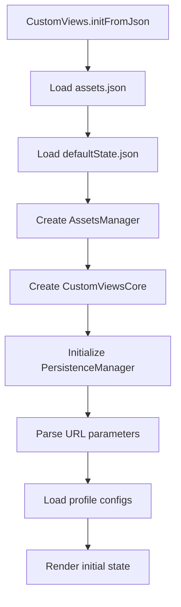
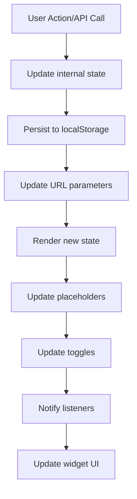
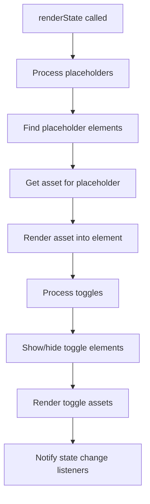

<frontmatter>
  title: Developer Architecture Guide
</frontmatter>

# Developer Architecture Guide

This document provides a deep dive into the Custom Views library architecture, explaining how the different components work together and how to extend or modify the library.

## Library Architecture Overview

The Custom Views library is built with a modular architecture consisting of several key components:

```
┌─────────────────────────────────────────────────────────────┐
│                     CustomViews Entry Point                 │
├─────────────────────────────────────────────────────────────┤
│  ┌─────────────────┐  ┌──────────────────┐  ┌─────────────┐ │
│  │  CustomViewsCore │  │ CustomViewsWidget │  │ Persistence │ │
│  │                 │  │                  │  │  Manager    │ │
│  └─────────────────┘  └──────────────────┘  └─────────────┘ │
├─────────────────────────────────────────────────────────────┤
│  ┌─────────────────┐  ┌──────────────────┐  ┌─────────────┐ │
│  │ AssetsManager   │  │   LocalConfig    │  │   Render    │ │
│  │                 │  │                  │  │   Engine    │ │
│  └─────────────────┘  └──────────────────┘  └─────────────┘ │
└─────────────────────────────────────────────────────────────┘
```

## Core Components

### 1. CustomViews (Entry Point)

**File:** `src/index.ts`

The main entry point that provides the `initFromJson()` static method for easy initialization.

```typescript
export class CustomViews {
  static async initFromJson(opts: InitFromJsonOptions): Promise<CustomViewsCore> {
    // Load assets JSON
    const assetsJson = await (await fetch(opts.assetsJsonPath)).json();
    const assetsManager = new AssetsManager(assetsJson);

    // Load Default State
    const defaultState: State = await (await fetch(opts.defaultStateJsonPath)).json();

    // Init CustomViews
    const core = new CustomViewsCore({
      assetsManager,
      defaultState,
      localConfigPaths: opts.localConfigPaths,
      rootEl: opts.rootEl,
      onViewChange: opts.onViewChange,
    });

    core.init();
    return core;
  }
}
```

**Key Responsibilities:**
- Entry point for library initialization
- Configuration loading and validation
- Core instance creation and setup
- Global window object exposure for browser environments

### 2. CustomViewsCore

**File:** `src/core/core.ts`

The main orchestrator that handles state management, URL parsing, and DOM manipulation.

```typescript
export class CustomViewsCore {
  private rootEl: HTMLElement;
  private assetsManager: AssetsManager;
  private persistenceManager: PersistenceManager;
  private localConfig: LocalConfig | null = null;
  private profileFromUrl: string | null = null;
  private stateIdFromUrl: string | null = null;
  
  // State change listeners for widgets and external integrations
  private stateChangeListeners: Array<() => void> = [];
}
```

**Key Responsibilities:**
- DOM element discovery and manipulation
- State management and transitions
- URL parameter parsing and handling
- Profile and configuration loading
- Event listener management
- Public API for programmatic control

**Core Methods:**

```typescript
// Profile management
async switchToProfile(profileId: string, stateId?: string): Promise<void>
switchToState(stateId: string): void
getAvailableProfiles(): string[]
getAvailableStates(): string[]
getCurrentView(): { profile: string | null; state: string | null }

// Persistence
clearPersistence(): void
hasPersistedData(): boolean
getPersistedView(): { profile: string | null; state: string | null }

// Event handling
addStateChangeListener(listener: () => void): void
removeStateChangeListener(listener: () => void): void
```

### 3. AssetsManager

**File:** `src/models/AssetsManager.ts`

Manages the loading, storage, and retrieval of content assets.

```typescript
export class AssetsManager {
  private assets: Record<string, CustomViewAsset>;

  constructor(assetsJson: Record<string, CustomViewAsset>) {
    this.assets = assetsJson;
  }

  getAsset(id: string): CustomViewAsset | null {
    return this.assets[id] || null;
  }

  hasAsset(id: string): boolean {
    return id in this.assets;
  }
}
```

**Key Responsibilities:**
- Asset storage and retrieval
- Asset validation and type checking
- Providing assets to the render engine

### 4. LocalConfig

**File:** `src/models/LocalConfig.ts`

Represents a profile configuration with its allowed assets, toggles, and predefined states.

```typescript
export class LocalConfig {
  public id: string;
  public modifiablePlaceholderAssets: Record<string, string[]>;
  public allowedToggles: string[];
  public states: Record<string, State>;
  public defaultState: string;

  constructor(configJson: any) {
    this.id = configJson.id;
    this.modifiablePlaceholderAssets = configJson.modifiablePlaceholderAssets || {};
    this.allowedToggles = configJson.allowedToggles || [];
    this.states = configJson.states || {};
    this.defaultState = configJson.defaultState || 'default';
  }
}
```

**Key Responsibilities:**
- Profile configuration management
- State validation and constraints
- Asset permission management

### 5. PersistenceManager

**File:** `src/core/persistence.ts`

Handles localStorage operations for saving and retrieving user preferences.

```typescript
export class PersistenceManager {
  private static readonly STORAGE_KEY = 'customViews-persistence';
  
  persistView(profile: string | null, state: string | null): void
  persistProfile(profile: string): void
  persistState(state: string): void
  getPersistedView(): { profile: string | null; state: string | null }
  clearAll(): void
  hasPersistedData(): boolean
  debugLog(): void
}
```

**Key Responsibilities:**
- localStorage integration
- Data serialization/deserialization
- Persistence validation and error handling
- Debug utilities

### 6. Render Engine

**File:** `src/core/render.ts`

Handles the actual DOM manipulation and asset rendering.

```typescript
export function renderAssetInto(
  element: HTMLElement, 
  assetId: string, 
  assetsManager: AssetsManager
): void {
  const asset = assetsManager.getAsset(assetId);
  if (!asset) {
    console.warn(`Asset not found: ${assetId}`);
    return;
  }

  // Clear existing content
  element.innerHTML = '';
  element.removeAttribute('hidden');

  // Render based on asset type
  switch (asset.type) {
    case 'image':
      renderImageAsset(element, asset);
      break;
    case 'html':
      renderHtmlAsset(element, asset);
      break;
    case 'text':
      renderTextAsset(element, asset);
      break;
    default:
      console.warn(`Unknown asset type: ${asset.type}`);
  }
}
```

**Key Responsibilities:**
- Asset-to-DOM rendering
- Type-specific rendering logic
- DOM cleanup and manipulation
- Error handling for missing assets

### 7. CustomViewsWidget

**File:** `src/core/widget.ts`

Optional UI component for user interaction with the library.

```typescript
export class CustomViewsWidget {
  private core: CustomViewsCore;
  private container: HTMLElement;
  private widgetElement: HTMLElement | null = null;
  private options: Required<WidgetOptions>;

  render(): HTMLElement
  updateWidgetState(): void
  toggle(): void
  destroy(): void
}
```

**Key Responsibilities:**
- UI generation and management
- User interaction handling
- State synchronization with core
- Theme and positioning management

## Data Flow

### 1. Initialization Flow



### 2. State Change Flow



### 3. Rendering Flow



## Extension Points

### 1. Custom Asset Types

You can extend the render engine to support custom asset types:

```typescript
// Extend the render function
function renderCustomAsset(element: HTMLElement, asset: CustomViewAsset): void {
  if (asset.type === 'chart') {
    // Custom chart rendering logic
    const chartData = asset.data;
    renderChart(element, chartData);
  } else if (asset.type === 'video') {
    // Custom video rendering logic
    const videoEl = document.createElement('video');
    videoEl.src = asset.src;
    element.appendChild(videoEl);
  }
}

// Override the default renderAssetInto function
const originalRender = renderAssetInto;
renderAssetInto = function(element, assetId, assetsManager) {
  const asset = assetsManager.getAsset(assetId);
  if (asset && ['chart', 'video'].includes(asset.type)) {
    renderCustomAsset(element, asset);
  } else {
    originalRender(element, assetId, assetsManager);
  }
};
```

### 2. Custom Persistence

You can replace the localStorage-based persistence with custom storage:

```typescript
class DatabasePersistenceManager extends PersistenceManager {
  async persistView(profile: string | null, state: string | null): Promise<void> {
    // Save to database instead of localStorage
    await fetch('/api/user-preferences', {
      method: 'POST',
      body: JSON.stringify({ profile, state })
    });
  }

  async getPersistedView(): Promise<{ profile: string | null; state: string | null }> {
    // Load from database
    const response = await fetch('/api/user-preferences');
    return response.json();
  }
}
```

### 3. Custom Widget Styling

You can customize the widget appearance by overriding CSS or extending the widget class:

```typescript
class CustomWidget extends CustomViewsWidget {
  protected injectStyles(): void {
    // Inject custom styles instead of default ones
    const style = document.createElement('style');
    style.textContent = `
      .cv-widget {
        /* Custom widget styles */
        background: linear-gradient(135deg, #667eea 0%, #764ba2 100%);
        border-radius: 15px;
      }
    `;
    document.head.appendChild(style);
  }
}
```

### 4. Event System Extensions

You can extend the event system for more granular control:

```typescript
class ExtendedCustomViewsCore extends CustomViewsCore {
  private profileChangeListeners: Array<(profileId: string) => void> = [];
  private stateChangeListeners: Array<(stateId: string) => void> = [];

  addProfileChangeListener(listener: (profileId: string) => void): void {
    this.profileChangeListeners.push(listener);
  }

  addStateChangeListener(listener: (stateId: string) => void): void {
    this.stateChangeListeners.push(listener);
  }

  async switchToProfile(profileId: string, stateId?: string): Promise<void> {
    await super.switchToProfile(profileId, stateId);
    this.profileChangeListeners.forEach(listener => listener(profileId));
  }
}
```

## Performance Considerations

### 1. Asset Loading

- **Lazy Loading**: Assets are only loaded when needed
- **Caching**: The AssetsManager caches loaded assets
- **Chunking**: Consider splitting large asset collections

### 2. DOM Manipulation

- **Batching**: DOM changes are batched to minimize reflows
- **Element Reuse**: Elements are reused when possible
- **Efficient Queries**: Uses targeted DOM queries with data attributes

### 3. Memory Management

- **Event Cleanup**: Listeners are properly removed on destroy
- **Asset Disposal**: Unused assets can be garbage collected
- **Widget Lifecycle**: Widgets properly clean up on destroy

## Testing Strategy

### 1. Unit Tests

Test individual components in isolation:

```typescript
describe('AssetsManager', () => {
  it('should return asset when it exists', () => {
    const assets = { 'logo': { id: 'logo', type: 'image', src: '/logo.png' } };
    const manager = new AssetsManager(assets);
    expect(manager.getAsset('logo')).toBeDefined();
  });
});
```

### 2. Integration Tests

Test component interactions:

```typescript
describe('CustomViewsCore Integration', () => {
  it('should render state correctly', async () => {
    const core = await CustomViews.initFromJson(config);
    await core.switchToProfile('profileA', 'advanced');
    
    const element = document.querySelector('[data-customviews-placeholder="logo"]');
    expect(element.innerHTML).toContain('logo-advanced');
  });
});
```

### 3. E2E Tests

Test complete user workflows:

```typescript
describe('Widget Interaction', () => {
  it('should persist selections across page reloads', () => {
    // Interact with widget
    // Reload page
    // Verify state is restored
  });
});
```

## Debugging Tools

### 1. Console Debug Methods

The library exposes debug methods in development:

```javascript
// Access core instance
window.customViewsCore.getCurrentView()
window.customViewsCore.getAvailableProfiles()

// Debug persistence
window.customViewsPersistence.debugLog()
window.customViewsPersistence.getPersistedView()

// Test state changes
window.customViewsCore.switchToProfile('profileA', 'advanced')
```

### 2. Development Mode Features

Enable additional debugging in development:

```typescript
const isDevelopment = window.location.hostname === 'localhost';

if (isDevelopment) {
  // Enable verbose logging
  console.log('CustomViews Debug Mode Enabled');
  
  // Expose internal state
  window.customViewsDebug = {
    core: customViewsCore,
    persistence: persistenceManager,
    assets: assetsManager
  };
}
```

### 3. State Validation

Add validation helpers for development:

```typescript
function validateState(state: State): boolean {
  // Validate placeholders exist in assets
  for (const [key, assetId] of Object.entries(state.placeholders)) {
    if (!assetsManager.hasAsset(assetId)) {
      console.warn(`Invalid placeholder asset: ${assetId} for ${key}`);
      return false;
    }
  }
  
  // Validate toggle categories
  for (const toggle of state.toggles) {
    if (!localConfig.allowedToggles.includes(toggle)) {
      console.warn(`Invalid toggle: ${toggle}`);
      return false;
    }
  }
  
  return true;
}
```

## Migration and Versioning

### 1. Configuration Migration

When updating configurations, provide migration helpers:

```typescript
function migrateConfigV1toV2(oldConfig: any): any {
  return {
    ...oldConfig,
    version: 2,
    // Add new fields with defaults
    allowedToggles: oldConfig.allowedToggles || [],
    // Transform old structure
    states: transformStatesV1toV2(oldConfig.states)
  };
}
```

### 2. API Versioning

Maintain backward compatibility with version checks:

```typescript
if (config.version === 1) {
  config = migrateConfigV1toV2(config);
}
```

This architecture guide provides the foundation for understanding, extending, and maintaining the Custom Views library. The modular design makes it easy to customize specific components while maintaining the overall system integrity.
